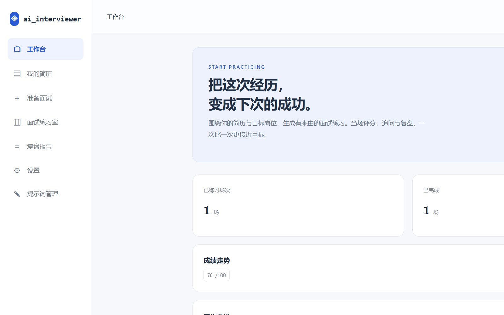
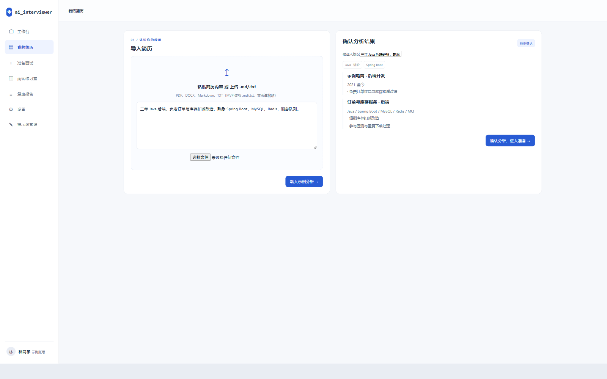
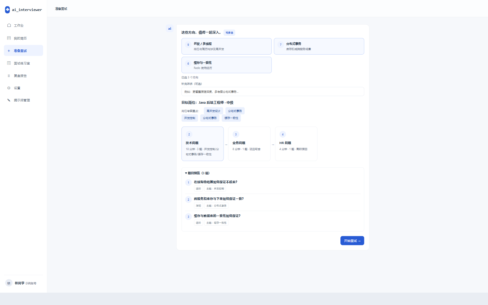
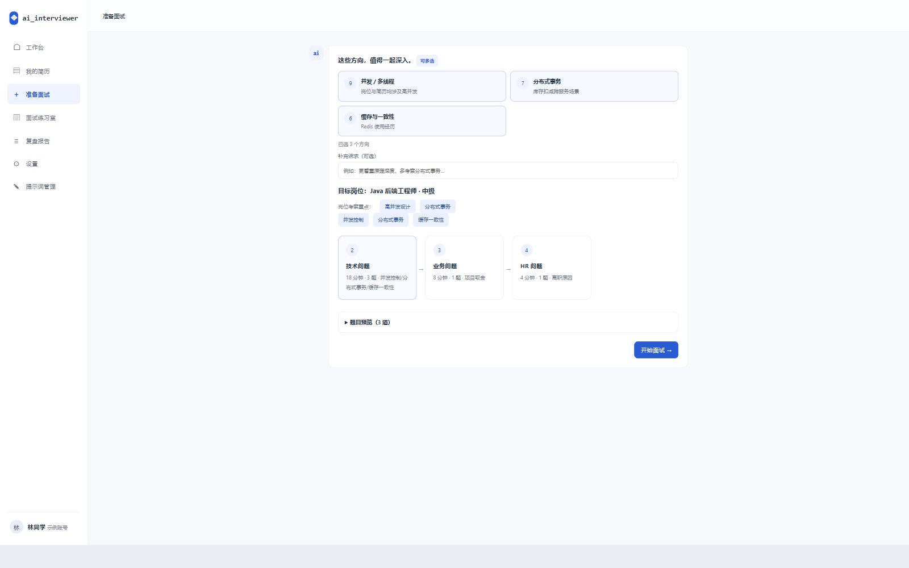
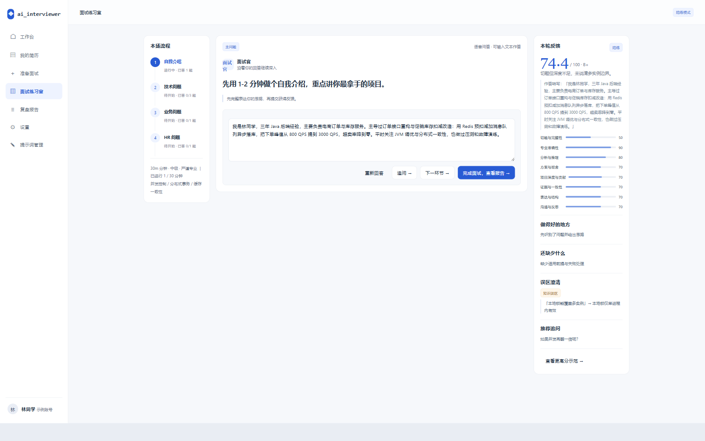
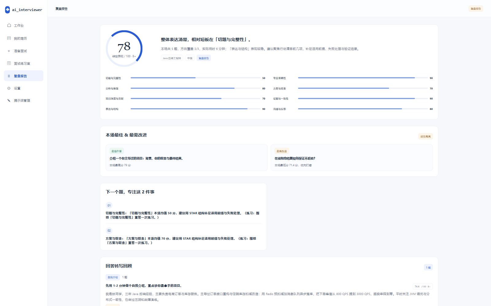
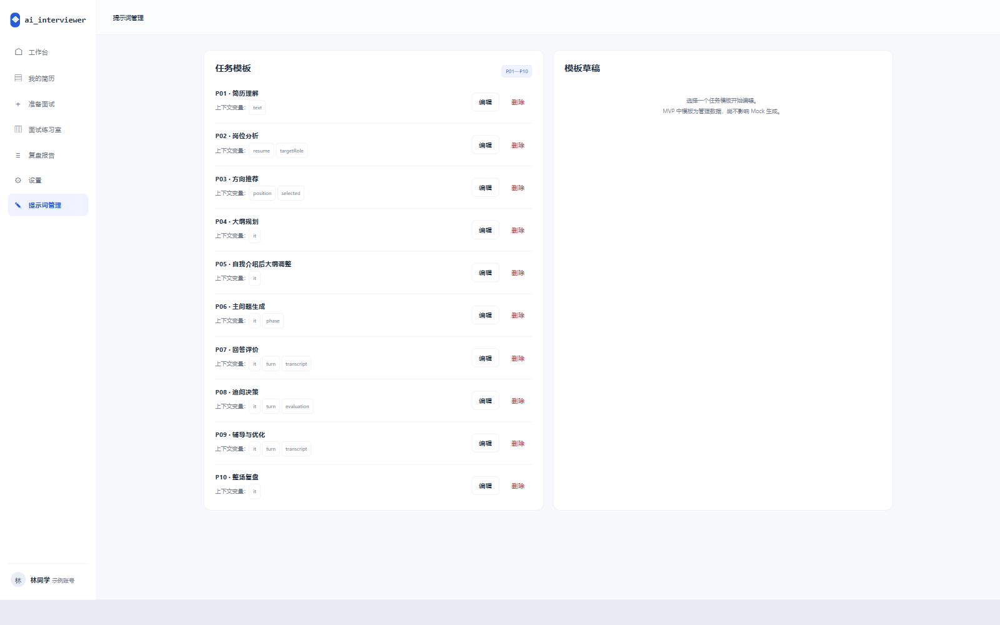
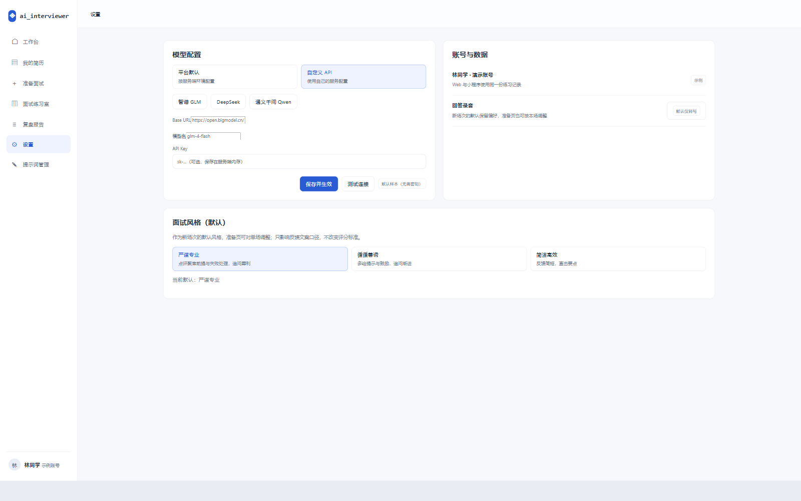

<div align="center">

# ai_interviewer

**面向 Java 后端求职者的实时语音面试训练 Agent**

简历解析 → 岗位对齐 → 结构化面试 → 当场反馈 → 整场复盘


</div>

---

## 这是什么

ai_interviewer 把「面试练习」做成一条完整闭环：先读懂你的简历和目标岗位，再生成一条**有来由、环环相扣**的面试流程，在练习室里逐题追问、当场给分，最后把整场表现归一成八维复盘报告。

- **有来由**：出题方向由「岗位 JD × 简历内容」共同驱动，每个方向都附推荐依据。
- **有深度**：主问题之后按回答继续追问，而不是念题库。
- **有闭环**：每轮给分与误区澄清，整场再归一到八维，并和上一场同岗位成绩对比。
- **可控**：陪练模式下大纲调整由你确认；模拟模式则全程不提示、结束统一复盘。

> 当前进度：需求与设计已定稿，**Web 单端 MVP 最小闭环可跑通**（无登录/数据库，默认 Mock 供应商，不配密钥也能走完全流程）。

---

## 界面与功能

### 1. 工作台



全部练习活动的入口与总览：

- **三重筛选**：岗位 / 状态（进行中·已完成）/ 模式（陪练·模拟），统计指标与下方列表同步缩范围。
- **核心指标**：已练习场次、已完成场次、平均表现（含等级）。
- **成绩走势**：最近几场综合分曲线，横向看进步。
- **平均八维**：按当前岗位范围聚合的八维均值，一眼看出长期短板。
- **历史场次**：进行中的场次直接显示当前环节，可一键继续，也可删除。

### 2. 我的简历



- 支持**粘贴文本**或上传 `.md / .txt`（PDF、DOCX 在 MVP 阶段请粘贴文本）。
- 解析后右侧展示**结构化结果**：候选人概况、项目经历、技能标签，可修正后确认。
- 内置「载入示例分析」一键体验，无需准备简历即可跑通全流程。

### 3. 准备面试

**目标岗位与考察方向**



- 目标岗位、级别（初级/中级/高级）、可选 **JD 文本**（填了出题更有针对性）。
- **方向推荐**由岗位与简历共同驱动，每个方向都带推荐依据，支持多选。
- 可选补充诉求（例如「更看重原理深度」）。
- 同步展示岗位考察重点，选完立刻给出「已选 N 个方向」。

**流程预览与开考**



- 练习方式：**陪练模式**（每轮评分与建议，边练边改）或**模拟面试**（过程不提示，结束统一复盘）。
- 计划时长档位：15 分钟专项 / 30 分钟标准 / 45 分钟深度。
- 面试风格（本场可调）：严谨专业 / 循循善诱 / 简洁高效。
- 录音保留开关：开启后复盘可回听。
- **流程预览**：环节计划（自我介绍 → 技术问题 → 业务问题 → HR 问题）逐环节标注时长与题量预算，并可展开题目预览，确认后开考。

### 4. 面试练习室



三栏式布局，对齐真实面试节奏：

| 区域 | 内容 |
|---|---|
| 左 · 本场流程 | 环节进度、已答题数、剩余时长、本场方向与风格 |
| 中 · 问答 | 题干、主题、难度、侧重维度；录音作答（实时转写）或直接输入文本 |
| 右 · 本轮反馈 | 综合分与等级、八维条形、做得好的地方、还缺少什么、**误区澄清**、推荐追问、更高分示范 |

每轮结束可**重新回答**、**追问 →**、**下一环节 →**，或直接**完成面试，查看报告 →**。

陪练模式下，自我介绍结束会依据新增信息给出**大纲调整建议**，由你确认应用或跳过——只影响未开始的内容。

### 5. 复盘报告



整场结束后，把每一轮的表现归一成一份可执行的复盘：

- **整场归一评分**：大环形综合分 + 等级（A+/A/B+/B/C）。
- **八维对照**：切题与完整性、专业准确性、分析与推理、方案与取舍、项目深度与贡献、证据与一致性、表达与结构、沟通与反思。
- **本场最佳 & 最需改进**：直接点名具体作答，附得分。
- **行动建议**：聚焦 2 件事，每条都带练习提示。
- **回答转写回顾**：逐题展示作答原文、得分与误区澄清；保留录音时可回听。
- **趋势对比**：同岗位下与「上一场」逐维对比。
- 支持导出 Markdown。

### 6. 提示词管理（管理员）



配套的管理员入口，任务模板 P01—P10 全部可维护：

| 模板 | 任务 |
|---|---|
| P01—P04 | 简历理解 · 岗位分析 · 方向推荐 · 大纲规划 |
| P05 | 自我介绍后大纲调整 |
| P06—P09 | 主问题生成 · 回答评价 · 追问决策 · 辅导与优化 |
| P10 | 整场复盘 |

- 每个模板展示**上下文变量**，便于排查拼接问题。
- 走**草稿 → 示例测试（含结果备注）→ 发布 → 回滚**流程；修改不影响进行中的面试（开场快照锁定版本），历史报告可追溯。

### 7. 设置



- **模型配置**：GLM / DeepSeek / 通义千问厂商预设一键带出，也可填自定义 Base URL / 模型名 / API Key，**运行期热切换、免重启**。
- 录音保留默认值、面试风格默认值（准备页按需覆盖本场）。

---

## 技术栈

| 层 | 选型 |
|---|---|
| 语言 | TypeScript 全栈 |
| 仓库 | pnpm 单仓：`apps/web` + `apps/server` + `packages/contracts` |
| 前端 | Vite + React 19 + TanStack Query |
| 后端 | NestJS 11 + Fastify |
| 契约 | zod（zod-to-json-schema → `schemas/`） |
| 测试 | Vitest + Supertest，含端到端冒烟脚本 |
| 校验 | ESLint + Prettier |

---

## 快速开始

前置：Node ≥ 20、`pnpm`（如未有：`npm i -g pnpm` 或 `corepack enable`）。

```bash
# 首次安装依赖
pnpm install

# 后端（NestJS + Fastify，端口 3000）
pnpm --filter @ai-interviewer/server start

# 前端（Vite + React，端口 5173）
pnpm --filter @ai-interviewer/web dev --host
```

打开 http://localhost:5173 即可体验完整闭环：工作台 → 导入简历 → 准备面试 → 面试练习室 → 复盘报告。

### 接真实模型

不配密钥时服务端用 Mock 样本跑通全流程。接入真实文本模型（GLM / DeepSeek / Qwen，均为 OpenAI 兼容）有两条路：

1. 复制 [.env.example](.env.example) 为 `.env`，填 `AI_BASE_URL` / `AI_MODEL` / `AI_API_KEY`，重启后端；
2. 或启动后在 Web「设置 → 模型配置」里选厂商预设或填自定义 API，**运行期热切换、免重启**。

设置 `DATA_FILE`（见 `.env.example`）可启用最小持久化，简历 / 面试 / 转写 / 评价重启不丢（默认纯内存）。

### 测试与校验

```bash
pnpm -r run typecheck
pnpm -r run test
pnpm --filter @ai-interviewer/web run build   # 前端生产构建
pnpm smoke:e2e                                 # 端到端回归冒烟（需先启动后端）
```

---

## 第一版 UI 原型

仓库内保留早期交互原型 `prototype/index.html`，可直接用浏览器打开，或在根目录运行：

```bash
python -m http.server 8765 --bind 127.0.0.1 --directory prototype
```

访问 http://127.0.0.1:8765 ，顶部可切换 Web 与小程序尺寸预览。原型仅使用虚构数据，无真实语音、解析、模型请求或持久化，参见 [原型范围](docs/prototype-v1.md)。

---

## 文档

| 文档 | 内容 |
|---|---|
| [需求与决策记录](docs/requirements.md) | 范围、已确认项与待决项 |
| [系统架构与技术选型](docs/system-architecture.md) | 语音链路、模型路由、部署取向 |
| [接口与数据模型](docs/interface-and-data-model.md) | 实体关系、核心字段、接口清单 |
| [接口规范](docs/api-spec.md) | 每端点入参出参、错误码、鉴权 |
| [输出 Schema 与校验](docs/output-schemas.md) | P01—P10 输出骨架与评分口径 |
| [开发规范与验收标准](docs/dev-standard.md) | 分支提交、测试、安全、DoD |
| [提示词管理](docs/prompt-management.md) | 模板版本与发布流程 |
| [外部对接清单与操作手册](docs/external-integrations.md) | 大模型、数据库、语音、微信、对象存储、部署与上线验收 |
| [项目协作规范](AGENTS.md) | 协作约定与推进方式 |

---

## 当前边界

MVP 阶段刻意收窄，以下能力**尚未**包含或仅做了骨架：

- 无登录、无跨端账号体系；数据默认驻留内存，需显式配置 `DATA_FILE` 才持久化。
- 语音链路为级联基线（ASR → 文本 LLM → TTS），Web 端端到端实时仍在规划。
- 只做语音/文本问答，不含代码阅读题与在线编程。
- 管理员权限由前端演示，真实产品需服务端校验。
- 微信小程序端未开始实现。

后续方向见 [需求与决策记录](docs/requirements.md) 中的「后续待讨论」。
